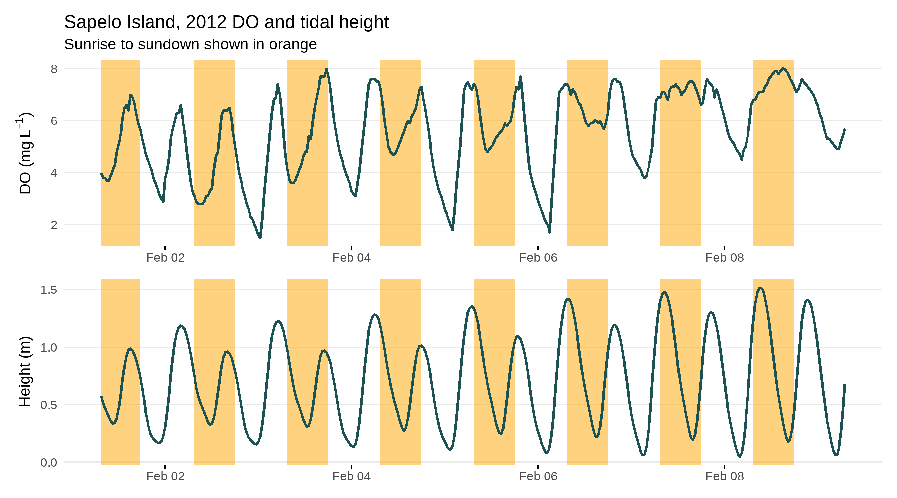

```{r setup, echo=FALSE, warning=FALSE, purl=FALSE, message=FALSE}
options(repos = "http://cran.rstudio.com/")
pkgs <- c("dplyr", "knitr")
x<-lapply(pkgs, library, character.only = TRUE)
opts_chunk$set(tidy = FALSE, message = F, warning = F)
```

# Detiding

Get the lesson R script: [detiding.R](detiding.R)

Get the lesson data: [download zip](data/779980.zip)

## Lesson Outline

- [Goals and Motivation]
- [Data import with SWMPr]
- [Cleaning and combining SWMP data]
- [Preparing SWMP data for detiding]
- [What is and why detiding]
- [Using WtRegDO to detide]

## Lesson Exercises

- [Exercise 1]
- [Exercise 2]
- [Exercise 3]

## Goals and Motivation

This lesson will teach you how to use the [SWMPr](https://cran.r-project.org/web/packages/SWMPr/index.html) package to import SWMP data and how to use the [WtRegDO](https://github.com/fawda123/wtregdo) package to detide a dissolved oxygen time series.  We'll also be using packages in the tidyverse to wrangle the data for use with the WtRegDO functions. Background information on SWMPr is [here](https://journal.r-project.org/archive/2016/RJ-2016-015/index.html) and background information on detiding is [here](https://aslopubs.onlinelibrary.wiley.com/doi/full/10.1002/lom3.10062).  

By the end of this lesson, you should know how or find the resources to be able to do the following:

* Load SWMPr and import data from Apalachicola and Sapelo Island using the `import_local` function
* Clean the SWMP data with `qaqc` and combine datasets with `comb`
* Use the dplyr package from the tidyverse to prepare the data for WtRegDO
* Understand if dissolved oxygen is correlated with tide and how WtRegDO "removes" the tidal signal
* Use WtRegDO to detide the DO time series

## Data import with SWMPr

Last time we got comfortable with [R basics](rbasics.html) by exploring how to get around the RStudio console, understanding the basics of the R language, and importing datasets for analysis.  Now that we have the basics out of the way, we can use some existing packages to work specifically with SWMP data. 

The SWMPr package was developed a few years ago to provide a bridge between the raw data and the R analysis platform. It does this with some degree of success, but by far it's most useful feature is being able to import and combine time series from SWMP sites with relative ease.  In particular, the `import_local`, `qaqc`, and `comb` functions allow us to quickly import, clean up, and combine datasets for follow-up analysis.  This is all we'll do with SWMPr in these lessons.

The `import_local` function is designed to work with data downloaded from the CDMO using the [Zip Downloads](http://cdmo.baruch.sc.edu/aqs/zips.cfm) feature from the Advanced Query System.  The files we have in our "data" folder were requested from this feature for all Apalachicola and Sapelo Island data from 2017 to 2019.

The `import_local` function has two arguments: `path` to indicate where the data are located and `station_code` to indicate which station to import.  We first load SWMPr and then use the function to import data for Apalachicola Dry Bar station:

```{r}
# load SWMPr
library(SWMPr)

# import data
apadbwq <- import_local(path = 'data', station_code = 'apadbwq')

# characteristics of the dataset
head(apadbwq)
dim(apadbwq)
range(apadbwq$datetimestamp)
```

Note that this function was able to import and combine data from multiple csv files.  We would have had to do this by hand if we were importing data with more general import functions available in R (e.g., `read_csv` from last time).

## Cleaning and combining SWMP data

Each row has data for multiple parameters at 15 minute intervals.  Each parameter also includes a column with QAQC flags, i.e., `f_` then the parameter name.  We can use the `qaqc` function to "screen" observations with specific QAQC flags.  You can view what the flags mean at this website: <http://cdmo.baruch.sc.edu/data/qaqc.cfm>.  We'll keep all data that have the flags 0, 1, 2, 3, 4, and 5 by indicating this information in the `qaqc_keep` argument (in practice, you may only want to keep data with a "zero" flag). You can view a tabular summary of the flags in a dataset using the `qaqcchk` function. 

```{r}
# keep only observations that passed qaqc chekcs
apadbwq <- qaqc(apadbwq, qaqc_keep = c('0', '1', '2', '3', '4', '5'))

# check the results
head(apadbwq)
dim(apadbwq)
range(apadbwq$datetimestamp)
```

Notice that the number of rows are the same as before - no rows are removed by `qaqc`.  Values that did not fit the screening criteria are given a `NA` value.  Also notice the flag columns are removed. 

Our metabolism functions also require weather data.  We can repeat the steps above to import and clean data from the weather station at Apalachicola. 

```{r}
# import weather data, clean it up
apaebmet <- import_local(path = 'data', station_code = 'apaebmet')
apaebmet <- qaqc(apaebmet, qaqc_keep = c('0', '1', '2', '3', '4', '5'))

# check the results
head(apaebmet)
dim(apaebmet)
range(apaebmet$datetimestamp)
```

The `comb` function in SWMPr lets us combine data from two locations using the `datetimestamp` column.  We'll need to do this to use the functions in the WtRegDO package that require both water quality and weather data.  

There are a couple of arguments to consider when using the `comb` function.  First, the `timestep` argument defines the time step for the resulting output.  Keep this at 15 to retain all of the data.  You could use a larger time step to subset the data if, for example, we wanted data every 60 minutes. Second, the `method` argument defines how two datasets with different date ranges are combined.  Use `method = 'union'` to retain the entire date range across both datasets or use `method = 'intersect'` to retain only the dates that include data from both datasets.  For our example, `union` and `intersect` produce the same results since the date ranges are the same. 

To speed up the examples in our lesson, we'll use a 60 minute timestep.  In practice, it's better to retain all of the data (i.e., `timestep = 15`). 

```{r}
# combine water quality and weather data
apa <- comb(apadbwq, apaebmet, timestep = 60, method = 'union')

# check the results
head(apa)
dim(apa)
range(apa$datetimestamp)
```

## Exercise 1

Repeat the above examples but do this using data for Sapelo Island.  Import data for `sapdcwq` and `sapmlmet`, clean them up with `qaqc`, and combine them with `comb`. 

1. Open a new script in your RStudio project, save it with an informative title (e.g, `import-detiding.R`), and add a section header with `Ctrl + Shift + R`.
1. Load the SWMPr package with the `library` function.  This should already be installed from last time (i.e., `install.packages('SWMPR')`). 
1. Import and clean up `sapdcwq` with `import_local` and `qaqc`. 
1. Import and clean up `sapmlmet` with `import_local` and `qaqc`. 
1. Combine the two with `comb`. Use a 60 minute time step and use the `union` option. 

## Preparing SWMP data for detiding

Now we want to setup our data for use with functions in the WtRegDO package.  As with most R functions, the input formats are very specific requiring us to make sure the column names, locations, and types of columns in our data are exactly as needed.  The two functions in WtRegDO that we'll use in this lesson are `evalcor` and `wtreg`.  You can look at the examples in the help file for these functions to see what format we need (`?evalcor`, `?wtreg`). 

The WtRegDO package comes with an example dataset that has a format we can follow for our SWMP data. First we load WtRegDO and then examine the `SAPDC` example dataset.  This is the same site we used for the previous exercise, just with older data. 

```{r}
# load WtRegDO
library(WtRegDO)

# view first six rows of SAPDC
head(SAPDC)

# View the structure of SAPDC
str(SAPDC)
```

We can compare this to our Apalachicola dataset from before. 

```{r}
# view first six rows of apa
head(apa)

# view the structure of apa
str(apa)
```

So, we need to do a few things to our Apalachicola dataset to make it look like SAPDC so it will work with the functions.  We can use the dplyr package to "wrangle" the data into the correct format (here's a useful [cheatsheet](https://rstudio.com/wp-content/uploads/2015/02/data-wrangling-cheatsheet.pdf) for this package).  The dplyr package comes with the tidyverse. 

All we need to do is rename the columns and select the ones we want in the correct order.  This can all be done with the `select` function in dplyr.  Remember, we are trying to follow the exact format of the SAPDC dataset that comes with WtRegDO.

```{r}
# load dplyr
library(dplyr)

# select and rename columns
apa <- select(apa,
  DateTimeStamp = datetimestamp, 
  Temp = temp, 
  Sal = sal, 
  DO_obs = do_mgl,
  ATemp = atemp, 
  BP = bp, 
  WSpd = wspd, 
  Tide = depth
)

# show first six rows
head(apa)

# view structure
str(apa)
```

We can also verify the column names are the same between the two datasets.  Note the use of two equal signs - this is how we tell R to test for equality.  

```{r}
names(apa) == names(SAPDC)
```

Finally, we need to deal with pesky missing data values.  Most functions in R deal with missing data by either not working at all or providing some work-around to accommodate the missing values. The functions in WtRegDO are in the former category.  

Missing data in SWMP are not uncommon and they often occur when sondes or other equipment are down for maintenance or are otherwise broken for a period of time.  So, missing observations usually come in blocks where all parameters are unavailable, as opposed to only one parameter.  We can quickly remove rows with missing data using the `na.omit` function. Note that this will remove an entire row where even one parameter is missing data.  Usually this is not ideal for most data, but this is okay for our examples because we require all parameters at a time step to estimate metabolism. 

Here we see an example of a chunk of missing observations.

```{r}
apa[which(is.na(apa$Tide))[1:5], ]
```

Now we just remove the rows with missing data using `na.omit`. 

```{r}
# number of rows before
nrow(apa)

# omit missing rows
apa <- na.omit(apa)

# number of rows after
nrow(apa)
```

## Exercise 2

Repeat the above examples but use the combined dataset for Sapelo Island that you created in [Exercise 1].

1. Create a new section in your script using `Ctrl + Shift + r` and give it an appropriate name. 
1. Load the dplyr package with the library function. 
1. Simultaneously rename and select the date/time columns (`DateTimeStamp = datetimestamp`), water temperature (`Temp = temp`), salinity (`Sal = sal`), dissolved oxygen (`DO_obs = do_mgl`), air temperature (`ATemp = atemp`), barometric pressure (`BP = bp`), wind speed (`WSpd = wspd`), and tidal height (`Tide = depth`) columns in the Sapelo Island dataset with the `select` function from dplyr.  Don't forget to assign the new dataset to an object in your workspace (with `<-`).
1. Remove missing rows with `na.omit`.  How many rows were removed (e.g., `nrow` before and after)?  

## What is and why detiding

Now we can start using the detiding functions in WtRegDO.  The motivation is that the dissolved oxygen time series is correlated with the tide and we want to remove that signal prior to estimating metabolism.  A fundamental assumption of the methods we use to estimate metabolism is that the data represents a sample from the same place over time.  If a monitoring sonde is measuring dissolved oxygen moving past the sensor with changes in the tide, then we are potentially evaluating parcels of water with different metabolic histories.  

Quite literally, in order for the metabolism functions to work well, the DO time series should have a noticeable diel signal.  DO should start increasing with sunrise as photosynthesis/production begins, it should peak around mid-day when temperature and solar radiation is highest, and it should decrease with sundown and into the night as respiration processes dominate. A DO time series influenced by the tide will typically not follow this pattern.  Metabolism estimates from DO data with significant tidal influence will often appear as "anomalous", having negative values for production and positive values for respiration.  We'll discuss more about this next time. 

Here's an example from Sapelo Island demonstrating the problem. 

```{r, out.width = '100%', echo = F}

```

Detiding works by using a regression approach to estimate a "signal" of the tide in the DO time series and then removing that signal to produce a "normalized" DO time series.  This normalized time series is thought to represent a biological signal as opposed to both a biological and tidal signal in the observed DO time series.  The method is based off of work in [Hirsch et al. 2010](https://onlinelibrary.wiley.com/doi/full/10.1111/j.1752-1688.2010.00482.x) using a __moving window, weighted regression__ approach that fits a unique model to each point in the time series.  Each unique model is fit using a set of weights that determine the influence of observations in the window to the model fit at the center of the window. For detiding, these weights are determined by the time of day, number of days in the window, and a range of observations for the tidal height.  The "widths" of these windows have a direct effect on how well the model can detide the DO data.    

An additional consideration for detiding is that it does not work well during all times of the year.  The model is likely to remove a portion of the biological signal at times of the year when the tidal height is correlated with the sun angle.  In other words, when periods of peak productivity are correlated with tidal height, it's impossible to isolate and remove only the tidal signal.  The end result is a normalized DO time series that is likely to underestimate metabolism because a portion of the biological signal was also removed from the observed DO during detiding.  

Finally, detiding may not even be necessary for a DO time series.  If you have a suspicion that your DO data are tidally influenced, it's best to verify this before blank application of the detiding functions.  A simple plot of dissolved oxygen with the tide over time can be used to evaluate a potential correlation.  It can be better to estimate metabolism without detiding then to detide and estimate metabolism if there is no or a minimal tidal influence.   

For all of these reasons, detiding is an art that may require several iterations of model fitting to get the most desirable result.  Evaluating model fit is best achieved through evaluation of the metabolism estimates and we save that discussion for the next lesson. 

## Using WtRegDO to detide

If you have strong reason to believe your data are tidally influenced, first use the `evalcor` function to "evaluate the correlation" between tidal change and the sun angle.  These correlations will help you identify periods of time when you might expect the detiding functions to not work well by removing both the tidal and biological signal. 

The `evalcor` function requires an input dataset (as prepared from before), the time zone at the location, and the location lat/lon.  The time zone can be extracted from the `DateTimeStamp` column of the dataset.  The latitude and longitude can be found from the metadata in the zipped folder that was downloaded from CDMO or using the `site_codes()` function from SWMPr.  If using the latter approach, you'll need to [register](http://cdmo.baruch.sc.edu/webservices.cfm) your computer's IP address with CDMO. 

Site location info is needed so that the `evalcor` function can identify the angle of the sun at the location and time for each observation. The function may take a few minutes to run. 

```{r, fig.height = 4, fig.width = 8}
# get time zone
tz <- attr(apa$DateTimeStamp, which = 'tzone')
lat <- 29.6747
long <- 85.0583

evalcor(apa, tz = tz, lat = lat, long = long)
```

What we get is a time series of the correlation of tidal height with the sun angle.  We can expect the detiding method to work best when this correlation is at or close to zero.  So, in this case, detiding may not work as well in middle to late summer and early spring.  For periods of the year when detiding may not work, interpret the results with caution, or simply do not use detiding during those parts of the year. There is no specific rule defining a maximum acceptable correlation for detiding, but Beck et al. 2015 suggest time periods when correlations exceed +/- 0.2 may be problematic.

Now that we have an expectation for when detiding could work well, we can use the `wtreg` function to detide the DO time series. The same inputs for `evalcor` are used for `wtreg`.  The rest of the arguments for `wtreg` are left at their default value, including the window widths for weighted regression.  Running the function may also take a minute or two. 

```{r}
dtd <- wtreg(apa, tz = tz, lat = lat, long = long)
```

The output from `wtreg` is similar to the input dataset, but with some additional columns added.  The two most important ones are `DO_prd` and `DO_nrm` for the predicted DO time series from your observed data and `DO_nrm` for the "normalized" or detided time series.  

```{r}
head(dtd)
```

In the next lesson, we'll cover some ways to evaluate effectiveness of the detiding.  For now, we can look at a simple plot to get a sense of how detiding altered the data. This example uses the plotly library, you'll have to install it to recreate the plot.

```{r}
library(plotly)

plot_ly(dtd, x = ~DateTimeStamp, y = ~DO_obs, name = 'Observed DO', type = 'scatter', mode = 'lines') %>% 
  add_trace(y = ~DO_nrm, name = 'Detided DO', mode = 'lines') %>% 
  layout(xaxis = list(title = NULL), yaxis = list(title = "DO (mg/L)"))
```

There are a few things to note from the above graph.  First, the "normalized" detided DO time series has a much more noticeable diel signal.  This can often lead to less "anomalous" metabolism estimates.  Second,the detided time series has a diel amplitude that is much less than the observed time series.  This will usually be the case for detided data and the choice of window widths is important to provide a balance between removal of the tidal influence relative to the biological signal. We'll discuss this balance next time.

## Exercise 3

Try running the `evalcor` and `wtreg` functions on the Sapelo Island data from [Exercise 2].  

1. Run `evalcor` using `tz = 'America/Jamaica'`, `lat = 31.39`, and `long = -81.28`.
1. From the plot, what times of the year might you expect detiding to not work very well? 
1. Run `wtreg` using the same arguments in step 1.  If you have plotly installed, try plotting the results to see how the "normalized" time series compares to the observed. 

## Summary

In this lesson we learned how to import data with SWMPr, prepare the data for analysis with WtRegDO, evaluate the DO time series with `evalcor`, and run weighted regression with `wtreg` to detide the data.  Next time we'll cover the basics of estimating ecosystem metabolism and how we can use those results to evaluate the detiding results. 

